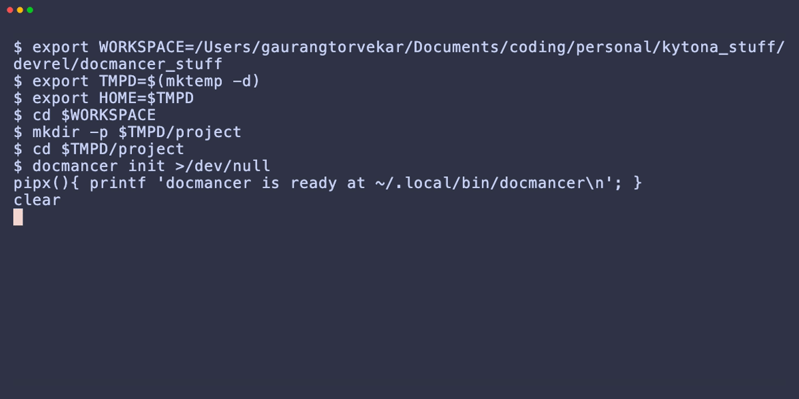

<div align="center">

**Local docs context for coding agents.**

[](https://pypi.org/project/docmancer/)
[](https://github.com/docmancer/docmancer/blob/main/LICENSE)
[](https://pypi.org/project/docmancer/)

[Install](#install) | [First run](#first-run) | [What you get](#what-you-get) | [Wiki](./wiki/Home.md)



</div>

---

Docmancer turns any pile of docs into a hybrid-search index your coding agent can query through a simple CLI. Point it at a folder of Markdown / PDF / DOCX / RTF / HTML, or at a docs URL (GitBook, Mintlify, generic web, GitHub), and ask questions in natural language. Results come back as compact context packs with source attribution, sized to fit a token budget.

A fresh install ships everything you need: SQLite FTS5, a docmancer-owned local Qdrant for dense and sparse vectors, FastEmbed for embeddings (no API key), and a hybrid retriever that fuses lexical, dense, and sparse signals with Reciprocal Rank Fusion.

## Install

```bash
pipx install docmancer    # Python 3.11, 3.12, or 3.13
```

If `pipx` picks an unsupported interpreter, pin one: `pipx install docmancer --python python3.13`.

## First run

Three commands take you from a fresh install to a grounded query:

```bash
docmancer setup                                     # config + database + agent skills
docmancer ingest ./docs                             # index local files
docmancer query "How do I authenticate?" --explain  # hybrid search across the index
```

`setup` creates `~/.docmancer/` with the config and SQLite database, auto-detects installed coding agents, and installs their skill files. On the first `ingest`, docmancer downloads the pinned Qdrant binary (~60 MB) and the FastEmbed models (~500 MB) into `~/.docmancer/`. After that, ingest stays offline.

Prefer to index a docs site instead of local files?

```bash
docmancer add https://docs.pytest.org
docmancer query "How do I parametrize a fixture?" --mode hybrid
```

## What you get

**Hybrid search by default.** `query` fans out across SQLite FTS5 (lexical, BM25-reranked), Qdrant dense vectors (FastEmbed `bge-base-en-v1.5`), and SPLADE sparse vectors, then fuses results with Reciprocal Rank Fusion. The token budget keeps responses small so your agent has room for actual work:

```text
Context pack: ~900 tokens vs ~4800 raw docs tokens (81.2% less docs overhead, 5.33x agentic runway)
```

**No API keys required.** FastEmbed runs locally. The optional OpenAI / Voyage / Cohere providers exist if you want them; if the key is missing, ingest falls back to FTS5-only and warns rather than aborting.

**Inspectable.** Every section is written to `~/.docmancer/extracted/` as Markdown plus JSON. `docmancer inspect` shows index stats. `docmancer query --explain` shows which signal (lexical / dense / sparse) placed each result.

**Agent integration built in.** `docmancer setup` drops skill files for Claude Code, Cursor, Codex, Cline, Claude Desktop, Gemini, GitHub Copilot, and OpenCode. Your agent can call `docmancer query` directly from its conversation loop.

## Documentation MCP server

Docmancer also has a minimal Context7-style MCP mode for library docs:

```bash
docmancer mcp docs-serve
```

Example MCP client config:

```json
{
  "mcpServers": {
    "docmancer-docs": {
      "command": "docmancer",
      "args": ["mcp", "docs-serve"]
    }
  }
}
```

Tools:

- `resolve_library_id`
- `get_library_docs`
- `refresh_library_docs`
- `prefetch_library_docs`
- `prefetch_project_docs`
- `list_library_docs`
- `get_docs_job_status`
- `list_docs_jobs`
- `cancel_docs_job`

The docs server uses the same local ingest, index, update, and query path as the CLI. It keeps a small persistent library registry in the Docmancer SQLite database. Libraries are stale when they have never been refreshed or when `last_refreshed_at` is older than 30 days. `get_library_docs` refreshes stale docs before querying, and `force_refresh: true` refreshes even fresh docs.

Pass `docs_url` the first time you ask for an unknown library. The server only resolves existing registry entries or explicit URLs; it does not guess package documentation URLs.

```json
{
  "library": "pytest",
  "topic": "parametrize fixture",
  "docs_url": "https://docs.pytest.org/"
}
```

### Prefetch progress

Long-running docs prefetch operations can run synchronously or asynchronously.

By default, `prefetch_docs_targets` and `prefetch_docs_manifest` run synchronously (`async: false`) and return after downloading/indexing finishes. Synchronous results include final metrics such as `duration_ms`, `pages_indexed`, `pages_failed`, `chunks_indexed`, `targets_completed`, and `targets_failed`.

Pass `async: true` to start a background job and return immediately:

```json
{
  "targets": [
    {
      "library": "riverpod-guides",
      "ecosystem": "web",
      "version": "latest",
      "source_type": "guides",
      "seed_urls": ["https://riverpod.dev/docs/introduction/getting_started"],
      "allowed_domains": ["riverpod.dev"],
      "path_prefixes": ["/docs/"]
    }
  ],
  "async": true
}
```

The async response contains a job id:

```json
{
  "job_id": "string",
  "status": "running",
  "message": "Started docs prefetch job."
}
```

Poll progress with `get_docs_job_status`:

```json
{
  "job_id": "string"
}
```

Job status includes target/page/chunk counters, current target, compact per-target summaries, warnings, errors, timestamps, and phases such as `validating`, `resolving`, `fetching`, `indexing`, `finalizing`, and `done`.

Use `list_docs_jobs` to see recent jobs, optionally filtered by `status`, and `cancel_docs_job` to request cancellation. Cancellation is checked between targets/pages; an in-progress indexing step may finish before the job stops.

Async jobs are in-memory and process-local. Jobs disappear when the MCP server process restarts, and the in-memory history is capped at 100 jobs. Polling with `get_docs_job_status` is the reliable progress path. MCP progress notifications are not implemented. `chunks_indexed` may be approximate because the current indexing API reports pages, not exact chunk counts.

### Versioned documentation

Docs MCP can keep separate local entries per library version. Canonical ids use `library@version`, for example:

- `go_router@14.8.1`
- `go_router@16.2.0`
- `go_router@latest`
- `flutter-api@stable`
- `flutter-api@main`

Use `prefetch_library_docs` to download and index multiple versions ahead of time:

```json
{
  "library": "go_router",
  "ecosystem": "pub",
  "versions": ["14.8.1", "15.0.0", "16.2.0", "latest"],
  "docs_url_template": "https://pub.dev/documentation/{library}/{version}/"
}
```

`docs_url_template` supports `{library}` and `{version}`. For pub.dev packages, `{library}` preserves underscores, so `go_router` renders as `go_router`, not `go-router`. Each rendered URL is stored and refreshed independently, so stale checks and force refresh apply per version.

Use `refresh_library_docs` when you want to refresh one registered library/version. It still accepts `versions` for compatibility, but `prefetch_library_docs` is the clearer tool for ahead-of-time multi-version indexing.

Query a specific version:

```json
{
  "library": "go_router",
  "ecosystem": "pub",
  "version": "14.8.1",
  "topic": "ShellRoute nested navigation"
}
```

If no version is provided and a `latest` entry exists, the server uses it and returns a warning: `No version was provided; using latest/default docs.`

### Project-aware Flutter/Dart docs

`get_library_docs` can inspect a local Flutter/Dart project when `project_path` is provided. It reads `.fvmrc` for Flutter channel/version hints and `pubspec.lock` for pub package versions. Explicit `version` always wins over project metadata.

```json
{
  "library": "go_router",
  "ecosystem": "pub",
  "topic": "ShellRoute nested navigation",
  "project_path": "/path/to/flutter_app"
}
```

If `pubspec.lock` contains `go_router: 14.8.1`, the server resolves `go_router@14.8.1` and uses:

```text
https://pub.dev/documentation/{library}/{version}/
```

Pub package versions from `pubspec.lock` are treated as exact docs snapshots. Responses include version metadata such as `requested_version`, `resolved_version`, `version_source`, `docs_snapshot_exact`, and `warnings` when available.

For ahead-of-time project prefetch, use `prefetch_project_docs`. It does not index every transitive dependency; pass the packages you want:

```json
{
  "project_path": "/path/to/flutter_app",
  "include_flutter": true,
  "include_dart": false,
  "include_packages": ["go_router", "riverpod"]
}
```

If a selected package is missing from `pubspec.lock`, the result includes `Package was not found in pubspec.lock.` If no version can be resolved, the result includes `No version was found in project metadata; using latest/default docs.`

For Flutter, keep the stable API docs and main API docs as separate versions:

```json
{"library": "flutter-api", "version": "stable", "docs_url": "https://api.flutter.dev/"}
{"library": "flutter-api", "version": "main", "docs_url": "https://main-api.flutter.dev/"}
```

Flutter channels can be represented directly as `version: "stable"` and `version: "main"`. Keep the API docs separate from the broader Flutter website if you need channel-specific API answers.

If `.fvmrc` contains a pinned Flutter SDK such as `3.24.5`, Docmancer uses it as a project version hint, but it does not create `flutter-api@3.24.5` for `https://api.flutter.dev/`. That URL is current stable API docs, so the canonical id is `flutter-api@stable`, `docs_snapshot_exact` is `false`, and the response warns that the docs are not an exact archived snapshot.

For pub.dev package APIs, prefer explicit package versions plus `latest`:

```json
{
  "library": "riverpod",
  "ecosystem": "pub",
  "versions": ["2.6.1", "3.0.0", "latest"],
  "docs_url_template": "https://pub.dev/documentation/{library}/{version}/"
}
```

Limitations: the server does not discover package versions automatically, does not infer release channels from source files, and does not guess documentation URLs. Pass explicit versions and URLs/templates when registering docs.

## Where to next

The wiki is the authoritative reference for everything else. Pick a page based on what you need:

| Page | When to read it |
|------|-----------------|
| **[Commands](./wiki/Commands.md)** | Core docs commands and advanced pack commands |
| **[Configuration](./wiki/Configuration.md)** | All YAML keys, env vars, and the API-key reference |
| **[Architecture](./wiki/Architecture.md)** | How ingest, retrieval, and MCP runtime actually work |
| **[Supported Sources](./wiki/Supported-Sources.md)** | What file formats and URL providers are covered |
| **[Install Targets](./wiki/Install-Targets.md)** | Where each agent's skill file lands |
| **[MCP Packs](./wiki/MCP-Packs.md)** | Version-pinned API tool packs |
| **[Troubleshooting](./wiki/Troubleshooting.md)** | Common errors and fixes |

[Wiki home](./wiki/Home.md) | [Changelog](./CHANGELOG.md) | [PyPI](https://pypi.org/project/docmancer/)
